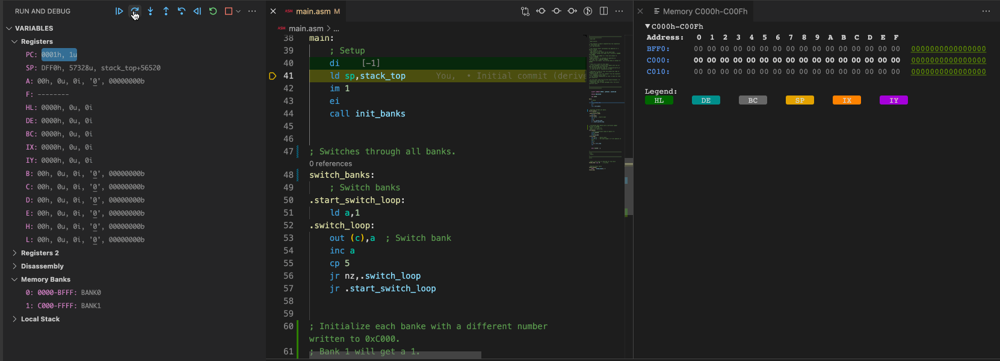

# z80-custom-memory-model-sample

# Introduction

This is a small Z80 assembler program that demonstrates how to define a custom memory model to emulate bank switched memory inside the internal simulator (zsim) of [DeZog](https://github.com/maziac/DeZog).


# Prerequisites

- Visual Studio Code (vscode)
- [DeZog](https://github.com/maziac/DeZog) (>= v3.0.0, not yet available)
- Z80 Assembler: sjasmplus, https://github.com/z00m128/sjasmplus

The program runs inside the internal Z80 simulator (zsim).

This is an "advanced" topic, so it is recommended that you have already some experience with debugging with DeZog.


# Building

First, if you just want to test debugging with the 'DeZog' extension there is no need to build/assemble the required files.
The binaries are included in this repository so that you could also directly start to debug.

However, if you would like to do some changes you need to compile.
From the menu choose "Terminal->Run Build Task..."
tasks.json is configured such that it will call sjasmplus with the required parameters.

This main.asm file is the one being assembled.

After the build is ready a z80-custom-memory-model-sample.obj file is created which can be used with 'zsim'.


# The Program Itself

The Z80 assembler program is used to demonstrate the bank switching with a custom defined memory model.

The model used here is very simple:
- Addresses 0x0000 - 0xBFFF are mapped to bank 0 which cannot be switched.
- Addresses 0xC000 - 0xFFFF are mapped to bank 1, 2, 3 or 4. Which bank is paged-in depends on a value that is written to a port.

DeZog's memory models support IO bank switching. I.e. by writing to a port it can be determined what bank is currently visible (read/write).

The address ranges are called slots. The memory that can be paged in are the memory banks.
The memory model is defined in 'launch.json' as:

~~~json
	"memoryModel": "CUSTOM",
	"customMemory": {
		"slots": [
			{
				"range": [
					"0x0000",
					"0xBFFF"
				],
				"banks": [
					{
						"index": 0
					}
				]
			},
			{
				"name": "slotC000",
				"range": [
					"0xC000",
					"0xFFFF"
				],
				"banks": [
					{
						"index": [
							1,
							4
						]
					}
				]
			},
		],
		"ioMmu": [
			"if(portAddress == 0x100) {",
			"  bank = portValue;",
			"  slotC000 = bank;",
			"}"
		]
	}
~~~

you need to choose "memoryModel" as "CUSTOM" then you can define the memory model in "customMemory".

'banks' can be defined either as a single bank (with a single index) or as a range of banks with start and end index.

"ioMmu" contains the javascript code that is executed whenever a 'OUT'  operation is performed by the Z80. It is an array of strings for better readability.
'portAddress' and 'portValue' are predefined values.
It is the address being written to and the value that was written.

In the example above the portValue is directly assigned to the slot named 'slotC000'.
You can address slots either by their optional names or by index.


# Program Flow

The program simply writes a number at address 0xC0000 in each of the banks ('init_banks') and then it switches all banks in a loop ('switch_banks').

From the launch.json a memory view is started with the debug session (```-mv 0xC000 16```).
While you step through the code you can see that the memory value at 0xC000 is changed with every OUT instruction.

In the VARIABLE's pane in the "Memory Banks" section you can see at the same time that the bank index for that slot also changes.

Single step through the code and have a look how the memory view and the "Memory Banks" change when the OUT is executed.


